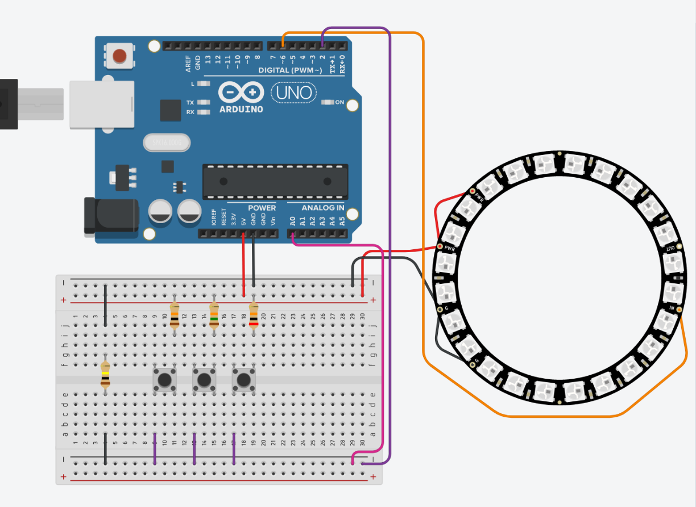

A simulação de um ventilador """seguro"""  
Entre muitas aspas por que um ventilador de teto não faz o que os professores [pediram](https://raw.githubusercontent.com/Trabalhos-PUC-PR/EXP3_VentiladorSeguro/main/VentiladorSeguro.pdf) de propósito, mas sim por causa da física normal mesmo  

